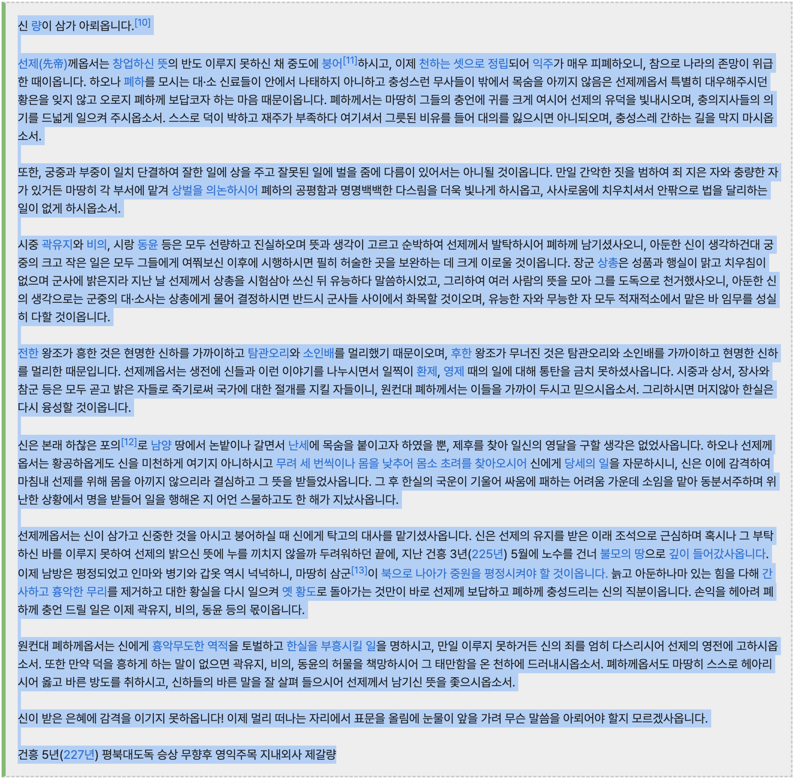
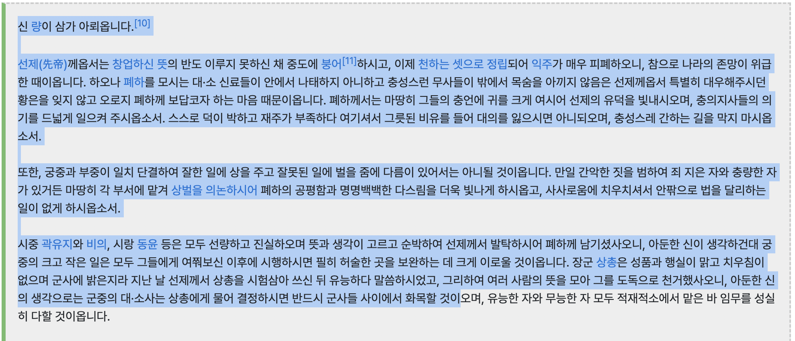
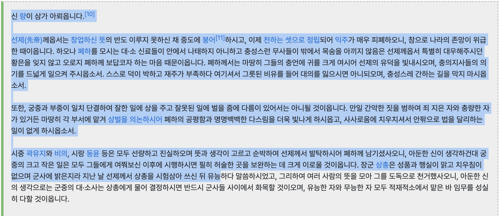

# 한글 텍스트 임베딩 모델 리더보드

Date: 2024년 8월 12일
Status: In progress

### Agenda

---

- 한글 텍스트 측정이 가능한 모델만을 대상
- 최근 확보한 GIANT GPU를 활용하여 짬짬이 성능 측정 (진행중)
- 최신 모델 또는 연구 결과 입수시 지속적으로 업데이트 예정

### 텍스트 임베딩 모델

---

| Model | Memory Usage (GB) | Embedding Dimensions | Max Tokens | Source | 기타 |
| --- | --- | --- | --- | --- | --- |
| Sentence-Roberta-Multitask  | 1.04 | 768 | 512 | jhgan/ko-sroberta-multitask |  |
| Multilingual-E5-Large  | 2.09  | 1024 | 514 | intfloat/multilingual-e5-large | dtype: float16 기준 |
| BGE-M3 | 8.46 | 1024 | 8192 | BAAI/bge-m3 | dtype: float16 기준 |

### 한글 텍스트 입력 범위

---

- 모델마다 토크나이저가 상이하여 같은 문장이지만 모델마다 다른 토큰 길이를 보임
- 아래에서는 샘플 입력 텍스트를 기준으로 모델마다 입력 가능한 텍스트 길이를 확인하고자 함
- 샘플 입력 텍스트는 제갈량의 출사표

`BGE-M3`

- 출사표 전문 입력 가능함

`Sentence-Roberta-Multitask`

- 출사표 2~3 문단 입력 가능함

`Multilingual-E5-Large`

- 출사표 2~3 문단 입력 가능함

### MTEB 평가

---

- 텍스트 임베딩의 성능을 다면적으로 평가하기 위한 벤치마크 셋
- 평가셋이 대부분 영어 위주로 구성되어 아래에서는 한글 데이터셋만 대상으로 성능 측정

| Task | Definition | Metric | Example |
| --- | --- | --- | --- |
| BitextMining | task of finding parallel sentences in two languages | F1 |  |
| Classification | task of assigning a label to a text | Accuracy |  |
| Clustering | task of grouping similar documents together | Validity Measure (V-measure) |  |
| PairClassification | task of determining whether two texts are similar | Average Precision |  |
| Reranking | task of reordering a list of documents to improve relevance | Mean Average Precision |  |
| Retrieval | task of finding relevant documents for a query | nDCG@10 |  |
| STS | task of determining how similar two texts are | Spearman Correlation |  |

### 성능 평가

---

| Model | Tatoeba BitextMining | Flores BitextMining | NTREX BitextMining | IWSLT2017 BitextMining | MassiveIntent Classification | MassiveScenario Classification | Klue-TC Classification | SIB200 Classification | MultilingualSentiment Classification | KorHateSpeechMLMultiLabel Classification | KorSarcasm Classification  | SIB200ClusteringS2S Clustering | Klue-NLI PairClassification | PawsX PairClassification | MIRACL Reranking | Ko StrategyQA Retrieval | XPQA Retrieval | PublicHealthQA Retrieval | MIRACL Retrieval | Belebele Retrieval | STS17 STS  | KorSTS STS | Klue-STS STS  |
| --- | --- | --- | --- | --- | --- | --- | --- | --- | --- | --- | --- | --- | --- | --- | --- | --- | --- | --- | --- | --- | --- | --- | --- |
| Sentence-Roberta-Multitask | 61.05 | eng-kor: 72.31 kor-eng: 86.39 | eng-kor: 52.16 kor-eng: 71.95 | eng-kor: 48.20 kor-eng: 59.26 | 64.80 | 70.12 | 52.10 | 69.75 | 73.82 | 8.93 | 57.11 | 36.41 | 78.38 | 52.89 | 48.33 | 65.10 | 27.96 | 69.21 | 36.69 | 81.63 | 86.46 | 85.58 | 84.13 |
| Multilingual-E5-Large | 89.70 | eng-kor: 99.42 kor-eng: 99.86 | eng-kor: 96.46 kor-eng: 98.93 | eng-kor: 87.11 kor-eng: 86.08 | 63.74 | 70.66 | 59.68 | 74.60 | 72.57 | 9.18 | 56.26 | 39.02 | 63.42 | 51.68 | 54.87 | 79.82 | 36.99 | 82.88 | 65.56 | 94.18 | 81.04 | 79.24 | 81.59 |
| BGE-M3 | 90.44 | eng-kor: 99.86 kor-eng: 100.00 | eng-kor: 98.60 kor-eng: 99.08 | eng-kor: 88.96 kor-eng: 88.59 | 66.53 | 72.90 | 54.67 | 71.91 | 78.16 | 10.92 | 56.79 | 38.04 | 70.05 | 52.34 | 59.98 | 79.40 | 36.15 | 80.41 | 70.14 | 93.18 | 81.42 | 80.26 | 87.70 |
